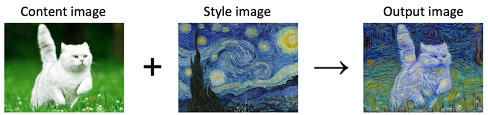
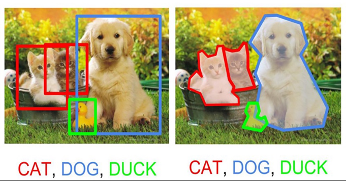
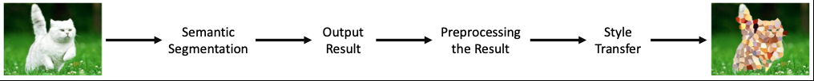

# artificial-intelligence
This repository contains AI project I did in 2019.

## Motivation
Normally, style transfer is conducted with the whole picture like the below example.

If you give an input image and a style image, you can get an output image with the input style. We just wonder about would it be possible to change a specific object of the picture to another style? To get the specific part of the picture, we are going to use Semantic Segmentation. 

First, we need to find out the output of semantic segmentation and the input of style transfer. In order to change specific part of the picture, the output of semantic segmentation and input of style transfer format have to be same. Therefore, we are going to find each format of output and input and preprocess the output to match with the input. Finally, we can get a selectively style-transferred picture.

Below process shows the flow of our Selective Style Transfer and contains expected output picture. 

## Project Code
You can check the [code](Final.ipynb)

## Project Result
The result image located in [result](/Results)
Also you can chen our [survey and its result](/Survey)
